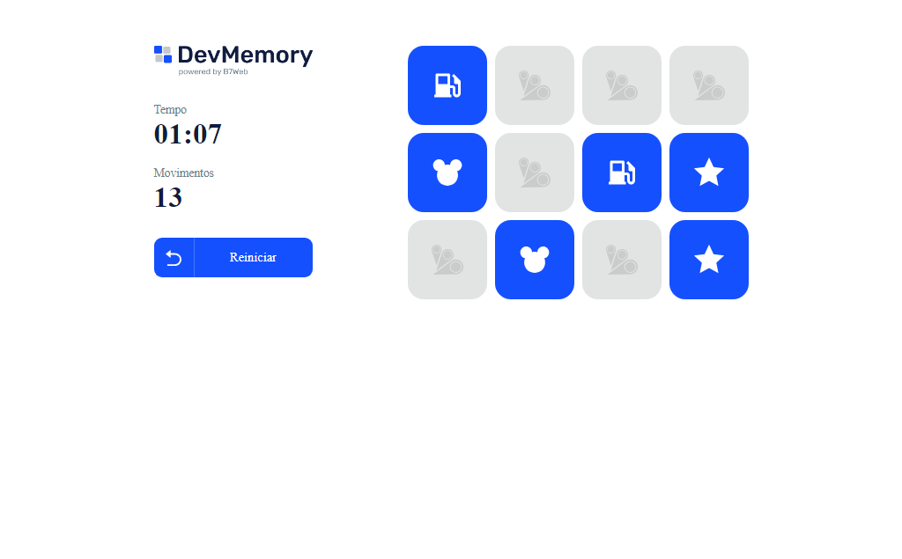

# Jogo da Memória

> Jogo

Projeto Jogo da Memória foi criado durante o curso da B7Web para praticar ReactJS.

[Clique para acessar](https://guimiiller.github.io/react_memoria/)

## 🚀 Tecnologias

- ReactJS
- Typescript
- CSS
- Git e Github

## 💻 O que aprendi

- Aprendi a usar a biblioteca styled components para estilização
- Usar o useEffect em um projeto real

## 📨 Contato

- guilhermemillerblack@gmail.com